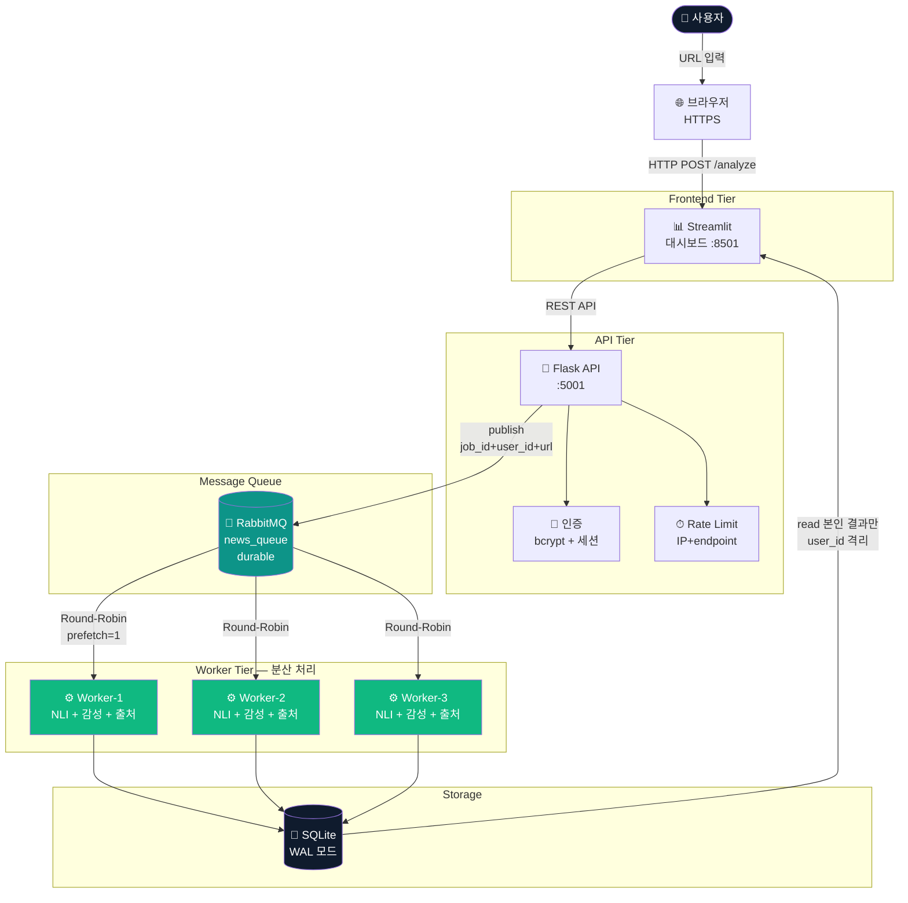
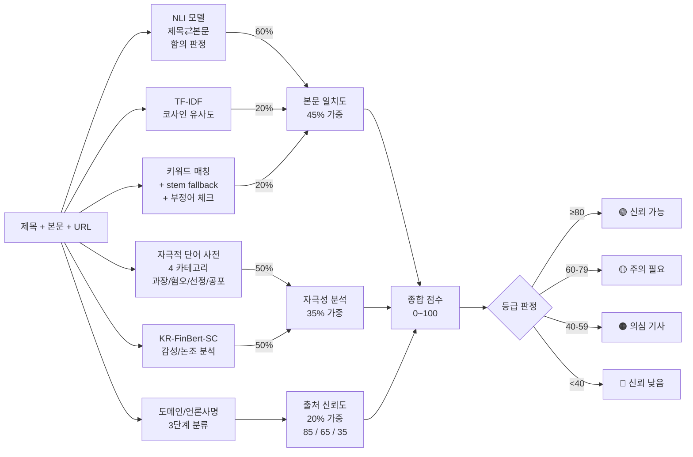
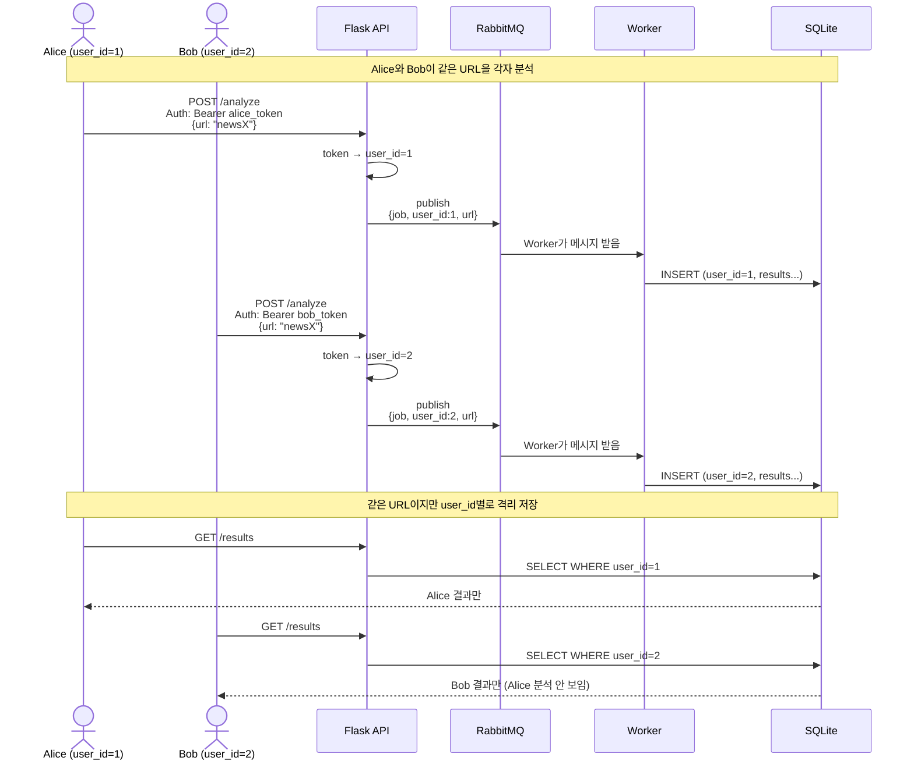

# K6 — 발표용 아키텍처 다이어그램

> 학회 발표 슬라이드에 그대로 사용 가능한 ASCII / Mermaid 다이어그램.
> PowerPoint 작업 시 다음을 캡쳐 또는 도형으로 재구현.

---

## 슬라이드 1 — 전체 시스템 아키텍처 (한 장 요약)

### Mermaid 코드 (GitHub/Notion에서 자동 렌더)


### ASCII 다이어그램 (PowerPoint 도형 가이드)
```
┌──────────────┐
│  사용자       │
│  (브라우저)  │
└──────┬───────┘
       │ URL 입력 + 로그인 토큰
       ▼
┌──────────────────────────────────┐
│  Streamlit 대시보드 (포트 8501)  │  ← 사용자별 격리 / PWA / 공유링크
└──────────────┬───────────────────┘
               │ REST API + Authorization Bearer
               ▼
┌──────────────────────────────────┐
│  Flask API 서버 (포트 5001)      │  ← bcrypt 인증 / Rate limit / 보안 헤더
└──────────────┬───────────────────┘
               │ publish (job_id, user_id, url)
               ▼
┌──────────────────────────────────┐
│         RabbitMQ                  │  ← 작업 분배 / 장애 복구
│      (news_queue, durable)        │
└──┬────────┬────────┬──────────────┘
   │        │        │  Round-Robin, prefetch=1
   ▼        ▼        ▼
┌──────┐ ┌──────┐ ┌──────┐
│ W-1  │ │ W-2  │ │ W-3  │  ← 독립 컨테이너 × 3
└──┬───┘ └──┬───┘ └──┬───┘     NLI + KR-FinBert + 출처
   │        │        │         + LRU 캐시 3종
   └────────┼────────┘
            ▼
    ┌─────────────┐
    │  SQLite WAL │  ← user_id 외래키 격리
    │  results.db │
    └─────────────┘
```

---

## 슬라이드 2 — 분석 알고리즘 흐름 (45/35/20)



---

## 슬라이드 3 — 분산 처리 핵심 메커니즘

```
┌─────────────────────────────────────────────────────────────┐
│             메시지 큐 기반 비동기 분산 처리                  │
└─────────────────────────────────────────────────────────────┘

[① 부하 분산 — Load Balancing]
   Worker-1   Worker-2   Worker-3
   ━━━━━━     ━━━━━━     ━━━━━━
   │ Job 1 │   │ Job 2 │   │ Job 3 │
   │ Job 4 │   │ Job 5 │   │ Job 6 │   ← RabbitMQ가 Round-Robin
   │ ...   │   │ ...   │   │ ...   │      균등 분배

[② 장애 복구 — Fault Tolerance]
   Worker-2 💥 크래시
   ━━━━━━
   │ Job 2 │ ← 처리 중이던 메시지
                 │
                 │  auto_ack=False
                 │  + ack 미수신
                 ▼
   RabbitMQ가 Job 2를 다른 Worker로 자동 재분배
   Worker-1 또는 Worker-3 ← Job 2 재처리

[③ 수평 확장 — Horizontal Scaling]
   docker compose up --scale worker=N
   Worker 추가 시 코드 수정 X
   → 자동으로 큐에 연결되어 분배 받기 시작
```

---

## 슬라이드 4 — 데이터 흐름 + 사용자 격리 (Phase G)



---

## 슬라이드 5 — CI/CD 자동 배포 흐름 (Phase I)

```
┌────────────────┐                   ┌─────────────────┐
│  개발자 (명호) │                   │  GitHub         │
│  Mac/VS Code   │                   │  myongho02/SSAK3│
└───────┬────────┘                   └────────┬────────┘
        │ git push origin main                │
        └────────────────────────────────────►│
                                              │
                          ┌───────────────────┘
                          │ trigger
                          ▼
                ┌──────────────────────┐
                │  GitHub Actions      │
                │  ┌────────────────┐  │
                │  │ CI: lint+build │  │
                │  │ smoke test     │  │
                │  └────────────────┘  │
                │  ┌────────────────┐  │
                │  │ Release:       │  │
                │  │ Build × 3      │  │
                │  │ Push GHCR      │  │
                │  └───────┬────────┘  │
                └──────────┼───────────┘
                           │ push
                           ▼
                ┌──────────────────────┐
                │  GHCR (Container     │
                │  Registry)           │
                │  ssak3-api:latest    │
                │  ssak3-worker:latest │
                │  ssak3-dashboard...  │
                └──────────┬───────────┘
                           │ docker pull
                           ▼
        ┌──────────────────────────────────┐
        │  팀원 노트북                      │
        │  docker compose pull && up -d    │
        │  → http://localhost:8501          │
        └──────────────────────────────────┘
```

---

## PowerPoint 적용 팁

1. **Mermaid 코드 사용**:
   - https://mermaid.live 에 코드 붙여넣기 → SVG 다운로드 → PowerPoint 삽입
   - 또는 GitHub markdown 렌더링 화면 캡쳐

2. **색상 통일** (SSAK3 디자인 시스템):
   - 네이비: `#0F1B2D` (배경 / 강조 텍스트)
   - 틸: `#0D9488` (포인트 / 액센트)
   - 회색: `#94A3B8` (보조 텍스트)
   - 등급별: 신뢰 가능 #10B981 / 주의 #F59E0B / 의심 #EF4444 / 낮음 #6B7280

3. **추천 슬라이드 순서** (3분 시연 영상용):
   - 슬라이드 1 (전체 아키텍처) — 30초
   - 슬라이드 3 (분산 처리 메커니즘) — 45초 ★ 지도교수 강조점
   - 슬라이드 2 (분석 알고리즘) — 45초
   - 슬라이드 4 (사용자 격리) — 30초
   - 슬라이드 5 (CI/CD) — 30초

4. **간단 버전** (10초 한 장 요약):
   ```
   ┌────────────────────────────────────────────┐
   │   사용자 → API → RabbitMQ → Worker×3 → DB  │
   │                  ↑              ↓           │
   │              부하 분산      병렬 분석        │
   │                                              │
   │   ➕ NLI(60%) + 코사인(20%) + 키워드(20%) │
   │      = 본문 일치도 45%                       │
   │      + 자극성 35% + 출처 20% = 종합          │
   └────────────────────────────────────────────┘
   ```
